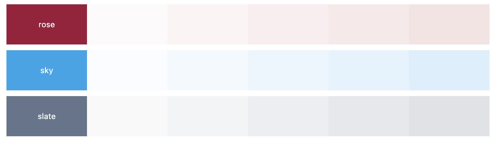
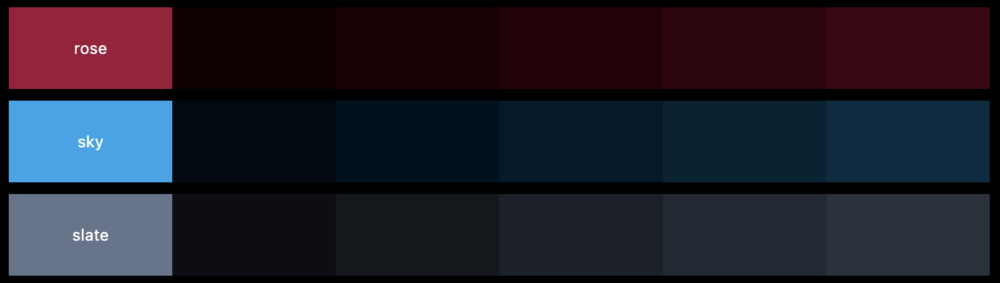
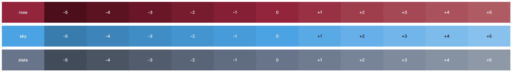

# Effective/Color

[![Sponsored by][sponsor-img]][sponsor] [![Version][npm-version-img]][npm] [![Downloads][npm-downloads-img]][npm]

[sponsor]: https://www.sebastian-software.de
[sponsor-img]: https://badgen.net/badge/Sponsored%20by/Sebastian%20Software/c41e54
[npm]: https://www.npmjs.com/package/@effective/color
[npm-downloads-img]: https://badgen.net/npm/dm/@effective/color
[npm-version-img]: https://badgen.net/npm/v/@effective/color

This [npm package](https://www.npmjs.com/package/@effective/color) is a TypeScript library designed for developers and designers to create sophisticated color palettes, similar to those seen in Tailwind CSS or Material Design systems. Unlike simpler tools that adjust colors by adding white or black or merely tweaking brightness and chroma, this library utilizes a scientifically based approach for color differentiation (CIEDE94).

## Features

- **Scientific Approach to Color Differentiation**: Instead of basic color manipulation, our library employs color mixing techniques in the _OKLab_ color space. It carefully adjusts the proportions of base colors to achieve perceptible changes in hue, saturation, or lightness, visible to the human eye, according to specific parameters.
- **Rooted in Color Theory**: The methodology is informed by color theory, ensuring that the generated palettes are not only visually appealing but also consistent with human visual perception.
- **TypeScript Support**: As a TypeScript library, it seamlessly integrates into your development workflow, enabling the direct implementation of complex color schemes in your projects without a graphical interface.

## Demo

To see our library in action and explore the possibilities it offers, check out our [Storybook demo](https://effective-color.vercel.app/).

## Getting Started

To begin using this library in your projects, simply add it to your project using npm:

```bash
npm install @effective/color
```

The library uses [culori](https://culorijs.org/) internally. Therefor all conversion methods from the library can be used to translate the resulting colors into the desired format e.g. [`formatCss()`](https://culorijs.org/api/#formatCss). Note: Using `formatHex` will clamp the values to the SRGB spectrum.

## API

### `buildShades()`

The `buildShades` function generates an array of color shades between two specified colors in the _Oklab_ color space. This function allows for the creation of smooth color stops from one color to another, which is primary meant for very light and very dark shades for one base color.

#### Parameters:

- **start**: `string` - The starting color in any CSS-compatible format.
- **end**: `string` - The ending color in any CSS-compatible format.
- **config**: `ShadeConfig` (optional) - An object specifying the configuration for shade generation, including:
  - **steps**: `number` [default=`5`] - The number of color shades to generate
  - **difference**: `number` [default=`2`] - The perceptual difference between consecutive shades. A higher value results in more distinct shades.
  - **compensation**: `number` [default=`5`] - A factor to adjust the progression curve of the color transition for very dark colors.

#### Returns:

- An array of `Oklab` objects representing the generated shades between the start and end colors.

#### Visual Example




### `buildSpectrum()`

The `buildSpectrum` function creates a color spectrum based on a starting color and configuration, allowing for the creation of a wide range of colors derived from a single base. This can be particularly useful for generating thematic color sets or for applications requiring a consistent but varied set of colors.

#### Parameters:

- **start**: `string` - The base color from which the spectrum will be generated, in any CSS-compatible format.
- **config**: `ShadeConfig` (optional) - An object specifying the configuration for the spectrum generation, similar to the `buildShades` function, but tailored to creating a broader spectrum of colors.

#### Returns:

- A `ColorSpectrum` object, which is a record of color identifiers mapped to their corresponding color values in either `Oklab` or `string` format. This structure facilitates easy access and manipulation of the color spectrum.

#### Visual Example



### `spectrumToList()`

The `spectrumToList` function converts a `ColorSpectrum` object into a list format, making it more convenient to iterate over or display the spectrum in a linear fashion, such as in a list or dropdown menu in a user interface.

#### Parameters:

- **spectrum**: `ColorSpectrum` - The color spectrum to convert, structured as a record of color identifiers to color values.

#### Returns:

- A `SpectrumList`, which is an array of `SpectrumEntry` objects, each containing:
  - **id**: `string` - The identifier of the color, serving as a key or label.
  - **value**: `string | Oklab` - The color value, which can be either a CSS-compatible string or an Oklab object.

## General Notes

- The use of the Oklab color space provides a more perceptually uniform color progression compared to traditional color spaces like RGB or HSL, making these functions particularly suitable for applications where color accuracy and perception are critical.
- Optional configuration in these functions allows for flexibility and fine-tuning of color generation, accommodating a wide range of use cases from subtle gradients to vibrant spectrums.

## License

[Apache License; Version 2.0, January 2004](http://www.apache.org/licenses/LICENSE-2.0)

## Copyright


Copyright 2024<br/>[Sebastian Software GmbH](https://www.sebastian-software.de)
